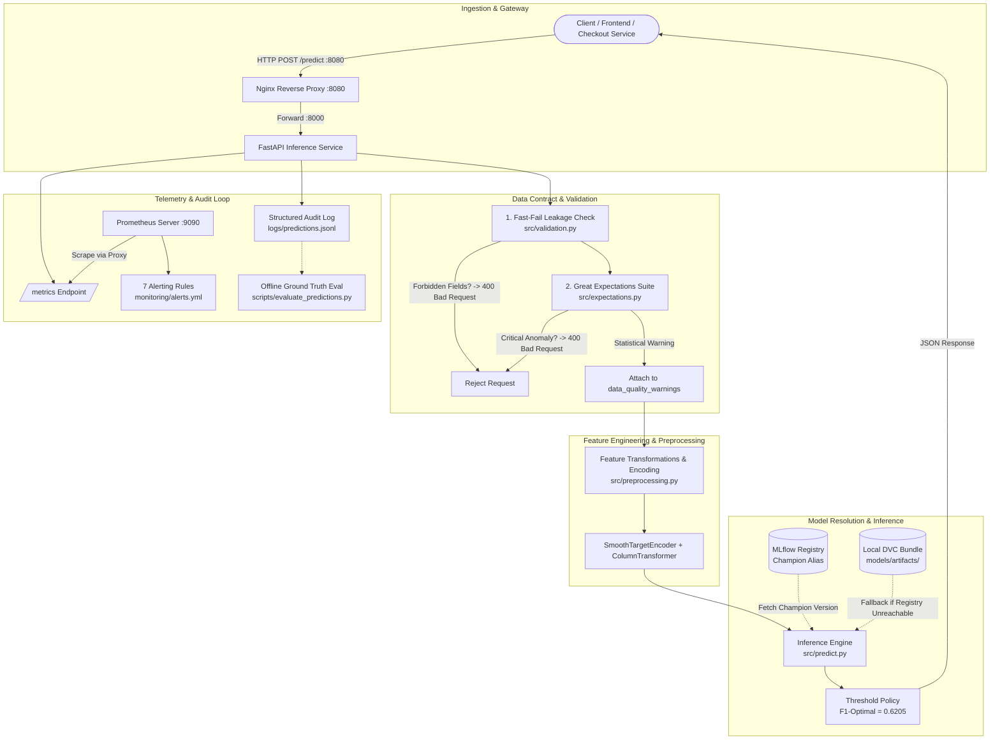

# 📦 Olist Late-Delivery Prediction Service — Production MLOps Platform

[](https://www.python.org/)
[](https://fastapi.tiangolo.com/)
[](https://mlflow.org/)
[](https://dvc.org/)
[](https://greatexpectations.io/)
[](https://www.docker.com/)
[](https://prometheus.io/)
[](https://nginx.org/)
[](.github/workflows/ci.yml)
[](tests/)

An enterprise-grade, end-to-end MLOps inference microservice predicting delivery delay risks at checkout time for the **Brazilian E-Commerce (Olist)** dataset.


This repository takes exploratory feature engineering and model tuning pipelines and hardens them into a resilient, containerized production service with **strict data contract validation**, **DVC artifact versioning**, **MLflow model registry governance**, **Prometheus observability & alerting**, **Nginx reverse proxying**, and **automated CI/CD**.

---

## 📑 Table of Contents

- [System Architecture](#-system-architecture)
- [Key Features](#-key-features)
- [Repository Structure](#-repository-structure)
- [Quick Start](#-quick-start)
  - [Option A: Docker Compose (Full Stack)](#option-a-docker-compose-recommended-full-stack)
  - [Option B: Local Development](#option-b-local-development)
- [API Specification & Contracts](#-api-specification--contracts)
  - [Endpoints Overview](#endpoints-overview)
  - [Inference Contracts & Leakage Prevention](#inference-contracts--leakage-prevention)
  - [Example Requests & Responses](#example-requests--responses)
- [MLOps Architecture & Components](#-mlops-architecture--components)
  - [1. Data & Artifact Versioning (DVC)](#1-data--artifact-versioning-dvc)
  - [2. Data Quality & Contract Enforcement (Great Expectations)](#2-data-quality--contract-enforcement-great-expectations)
  - [3. Model Registry & Dynamic Promotion (MLflow)](#3-model-registry--dynamic-promotion-mlflow)
  - [4. Monitoring, Observability & Alerting (Prometheus)](#4-monitoring-observability--alerting-prometheus)
  - [5. Prediction Logging & Ground-Truth Evaluation](#5-prediction-logging--ground-truth-evaluation)
  - [6. Continuous Integration & Delivery (CI/CD)](#6-continuous-integration--delivery-cicd)
- [Production Engineering & Gotchas](#-production-engineering--gotchas)
- [Testing & Quality Assurance](#-testing--quality-assurance)

---

## 🏛️ System Architecture



---

## 🌟 Key Features

| Capability | Implementation | Purpose |
|---|---|---|
| **Inference Framework** | [FastAPI](https://fastapi.tiangolo.com/) + Uvicorn | Sub-millisecond async routing, auto-generated OpenAPI/Swagger schemas. |
| **Reverse Proxy** | [Nginx](https://nginx.org/) (`nginx:1.27-alpine`) | Unified gateway on port `8080`, header propagation, metrics routing. |
| **Artifact Versioning** | [DVC](https://dvc.org/) + Azure Blob Storage | Model, preprocessor, and encoder tracked as an **atomic bundle** (`models/artifacts/`). |
| **Model Registry** | [MLflow](https://mlflow.org/) (Postgres backend + S3/volume artifacts) | Zero-downtime model rollouts via the `"champion"` alias; resilient local fallback. |
| **Data Quality Validation** | [Great Expectations](https://greatexpectations.io/) + Custom Validators | Two-tier contract: rejects critical structural errors, flags rare categories without failing. |
| **Observability** | [Prometheus](https://prometheus.io/) Client & Scraper | Exposes request latency, error rates, model score distribution, and drift indicators. |
| **Alerting System** | Prometheus Alert Rules (`monitoring/alerts.yml`) | 7 production-grade alert rules verified with `promtool` (critical vs. warning severities). |
| **Ground-Truth Feedback** | Structured JSONL Logging (`src/prediction_log.py`) | Decoupled prediction audit logs for delayed ground-truth joins & offline metrics calculation. |
| **Continuous Integration** | [GitHub Actions](https://github.com/features/actions) | Linting (`ruff`), formatting (`black`), pre-commit hooks, DVC pulls, Pytest, and GHCR publishing. |

---

## 📂 Repository Structure

```text
├── .dvc/                            # DVC configuration (Azure Blob Storage remote)
├── .github/workflows/ci.yml         # CI/CD pipeline (lint, test, DVC pull, Docker GHCR push)
├── .pre-commit-config.yaml          # Pre-commit hooks for code hygiene and styling
├── Dockerfile                       # Multi-stage production container build for API
├── docker/
│   └── mlflow.Dockerfile           # Lightweight MLflow tracking server container
├── docker-compose.yml               # Multi-service stack (postgres, mlflow, api, nginx, prometheus)
├── app/
│   └── main.py                     # FastAPI application (routes, middleware, error handling)
├── config/
│   └── config.yaml                 # Centralized single source of truth for all paths & parameters
├── data/                            # Local data directory (git-ignored, DVC-trackable)
├── great_expectations/
│   └── expectations/               # Generated Great Expectations JSON suites
├── models/
│   ├── artifacts/                  # DVC-tracked bundle: model, scaler, encoder, feature schemas
│   ├── artifacts.dvc               # DVC pointer file (tracked in git)
│   ├── results_summary.json        # Training and cross-validation performance metrics
│   └── serving_config.json         # Production serving policy (decision threshold, forbidden fields)
├── monitoring/
│   ├── prometheus.yml              # Prometheus scrape configuration
│   └── alerts.yml                  # 7 validated alerting rules (promtool verified)
├── nginx/
│   └── nginx.conf                  # Reverse proxy configuration routing to internal API
├── notebooks/                       # Training and exploratory data analysis notebooks
├── requirements/
│   ├── requirements.txt            # Minimal runtime dependencies for container/production
│   └── requirements-dev.txt        # Development, testing, linting, and DVC dependencies
├── scripts/
│   ├── build_expectation_suite.py  # Compiles and regenerates Great Expectations JSON suite
│   ├── evaluate_predictions.py     # Joins prediction logs with ground truth to assess real performance
│   └── log_to_mlflow.py            # Logs metrics/artifacts to MLflow and assigns 'champion' alias
├── src/                            # Core pipeline implementation
│   ├── config.py                   # Schema-validated settings loader with environment overrides
│   ├── data_access.py              # Robust artifact deserialization and namespace patcher
│   ├── expectations.py            # Great Expectations validation runner and reporter
│   ├── logger.py                   # Centralized structured logging configuration
│   ├── metrics.py                  # Prometheus metric declarations (counters, histograms, gauges)
│   ├── model_registry.py           # MLflow registry resolution and champion loading logic
│   ├── predict.py                  # End-to-end inference orchestrator with fallback handler
│   ├── prediction_log.py           # Structured JSONL prediction logging for auditing
│   ├── preprocessing.py            # Feature engineering, transformers, and leakage sanitization
│   ├── target_encoder.py           # SmoothTargetEncoder implementation
│   └── validation.py               # Fast-fail schema & forbidden-field leakage validator
├── tests/                          # Automated Pytest suite (40/40 tests passing)
└── pyproject.toml                  # Tool configurations for Ruff, Black, and Pytest
```

---

## 🚀 Quick Start

### Option A: Docker Compose (Recommended Full Stack)

Run the complete production ecosystem (PostgreSQL + MLflow Tracking Server + Model Seeder + FastAPI + Nginx Reverse Proxy + Prometheus) with a single command:

1. **Clone the repository and prepare environment variables**:
   ```bash
   cp .env.example .env
   ```

2. **Pull model artifacts using DVC**:
   ```bash
   dvc pull
   ```

3. **Launch the stack**:
   ```bash
   docker compose up --build
   ```

4. **Verify container services**:
   - 🌐 **Nginx Public Gateway**: [http://localhost:8080](http://localhost:8080)
   - 📖 **Interactive API Docs (Swagger)**: [http://localhost:8000/docs](http://localhost:8000/docs) (or [http://localhost:8080/docs](http://localhost:8080/docs))
   - 🧪 **MLflow Tracking UI**: [http://localhost:5001](http://localhost:5001)
   - 📊 **Prometheus Dashboard**: [http://localhost:9090](http://localhost:9090)
   - 📈 **Prometheus Metrics Stream**: [http://localhost:8080/metrics](http://localhost:8080/metrics)

> **Startup Lifecycle**: Handled automatically via Docker health checks: `postgres` becomes healthy ➔ `mlflow` server boots ➔ `mlflow-init` seeds run metrics and assigns the `"champion"` model alias ➔ `api` and `proxy` launch ➔ `prometheus` begins scraping.

---

### Option B: Local Development

If developing locally without Docker:

1. **Create and activate a virtual environment**:
   ```bash
   python3 -m venv .venv
   source .venv/bin/activate       # On Windows: .venv\Scripts\activate
   pip install --upgrade pip
   pip install -r requirements/requirements-dev.txt
   ```

2. **Retrieve versioned artifacts**:
   ```bash
   dvc pull
   ```

3. **Initialize local MLflow registry**:
   ```bash
   PYTHONPATH=. python scripts/log_to_mlflow.py
   ```
   *Logs the training run and registers `olist_late_delivery` with the `@champion` alias into local `mlflow.db`.*

4. **Start the API service**:
   ```bash
   uvicorn app.main:app --reload --host 0.0.0.0 --port 8000
   ```

5. **Run the test suite**:
   ```bash
   pytest
   ```

---

## ✅ Runtime Verification (example outputs)

Use these quick checks to verify the full stack is healthy and serving as expected. The examples below are taken from a local verification run; your addresses/ports may differ.

1) Verify containers and services (Docker Compose):

```bash
docker compose ps
```

Example output (services and ports):

```
trainingmlops-api-1        trainingmlops-api        Up (healthy)    0.0.0.0:8000->8000/tcp
trainingmlops-proxy-1      nginx:1.27-alpine        Up              0.0.0.0:8080->8080/tcp
trainingmlops-mlflow-1     trainingmlops-mlflow     Up (healthy)    0.0.0.0:5001->5000/tcp
trainingmlops-prometheus-1 prom/prometheus          Up              0.0.0.0:9090->9090/tcp
trainingmlops-grafana      grafana/grafana          Up              0.0.0.0:3000->3000/tcp
trainingmlops-postgres-1   postgres:16-alpine       Up (healthy)
```

2) Git branch (confirm working branch):

```bash
git branch --show-current
```

Example: `main`

3) Basic API health check:

```bash
curl -s http://localhost:8000/health
```

Example response:

```json
{"status":"ok"}
```

4) Active model information (inspect resolved model/version/threshold):

```bash
curl -s http://localhost:8000/model/info
```

Example response:

```json
{
  "name":"olist_late_delivery",
  "version":"notebook06-histgbm-checkout-v2",
  "decision_threshold":0.6204567106325278,
  "score_is_calibrated_probability":false
}
```

5) Prometheus / monitoring checks (targets & prediction metrics):

```bash
curl -s 'http://localhost:9090/api/v1/query' --data-urlencode 'query=up'
curl -s 'http://localhost:9090/api/v1/query' --data-urlencode 'query=prediction_predicted_late_total'
```

6) DVC status (ensure artifacts are present):

```bash
dvc --version && dvc status
```

Example: `3.67.1` and `Data and pipelines are up to date.`

Quick troubleshooting pointers:
- If `/health` is not `ok`, check `docker compose logs api` for tracebacks.
- If model info returns `503` or empty model, verify `mlflow` is reachable and that `dvc pull` completed successfully.
- If Prometheus shows missing targets, confirm the `proxy` and exporters are accessible on the configured ports.

---

---

## 📡 API Specification & Contracts

### Endpoints Overview

| Method | Route | Description | Status Codes |
|---|---|---|---|
| `GET` | `/health` | Primary service health status. | `200` |
| `GET` | `/health/live` | Kubernetes-standard liveness probe verifying ASGI worker responsiveness. | `200` |
| `GET` | `/health/ready` | Readiness probe confirming model artifacts are loaded in memory. | `200`, `503` |
| `GET` | `/monitoring/summary` | Real-time JSON telemetry summary (uptime, predictions count, late rate, model source). | `200` |
| `GET` | `/model/info` | Inspects active model metadata, decision threshold, and MLflow registry state. | `200` |
| `POST` | `/predict` | Evaluates a single order payload; returns delay probability, classification, and warnings. | `200`, `400`, `503`, `500` |
flowchartflowchart TD
    A[Olist Dataset] --> B[ETL Pipeline]
    B --> C[Feature Engineering]
    C --> D[Feature Store]
    D --> E[Model Training]
    E --> F[Experiment Tracking (MLflow)]
    F --> G[Model Registry]
    G --> H[Model Serving (FastAPI / Ray Serve)]
    H --> I[Containerization (Docker)]
    I --> J[Deployment]
    J --> K[Monitoring]
    K --> L[Continuous Retraining]
    L --> E| `GET` | `/metrics` | Prometheus metrics scrape endpoint. | `200` |


---

### Inference Contracts & Leakage Prevention

The service enforces strict temporal boundaries matching checkout time:

#### 1. Input Contract (`KNOWN_SAFE` Checkout Fields)
All inference requests must supply the pre-outcome features available at checkout:
- **Timestamps**: `order_purchase_timestamp`, `order_estimated_delivery_date`
- **Monetary Values**: `total_freight_value`, `total_item_value`, `total_payment_value`
- **Order Structure**: `payment_count`, `max_payment_installments`, `item_count`, `unique_sellers`, `unique_products`
- **Customer Geolocation**: `customer_zip_code_prefix`, `customer_city`, `customer_state`
- **Seller Geolocation**: `seller_zip_code_prefix`, `seller_city`, `seller_state`
- **Geographic Proximity**: `distance_km`
- *(Optional)*: `order_id` (propagated to prediction audit logs for ground-truth reconciliation, dropped prior to model input).

#### 2. Strictly Forbidden Fields (Data Leakage Protection)
The API strictly rejects (`400 Bad Request`) any payload containing fields generated after checkout:
- `order_delivered_customer_date`, `order_delivered_carrier_date`
- `order_approved_at`, `approval_delay_hours`
- `review_score`, `review_comment_message`, `review_creation_date`

#### 3. Output Contract & Policy Knob
- `late_probability`: Continuous ranking score output from `HistGradientBoostingClassifier` (uncalibrated probability).
- `predicted_late`: Boolean decision derived from `late_probability >= decision_threshold`.
- `decision_threshold`: Set to **`0.6205`** (tuned for F1-score optimization on validation data). This is a business policy threshold decoupled from model retraining.
- `data_quality_warnings`: List of non-fatal statistical anomalies detected by Great Expectations (e.g., unseen rare states).

---

### Example Requests & Responses

#### Single Prediction Request (`/predict`)

```bash
curl -X POST http://localhost:8080/predict \
  -H "Content-Type: application/json" \
  -d '{
    "order_id": "ord_8921a",
    "order_purchase_timestamp": "2026-03-01T14:30:00",
    "order_estimated_delivery_date": "2026-03-15T00:00:00",
    "total_freight_value": 24.50,
    "total_item_value": 119.90,
    "total_payment_value": 144.40,
    "payment_count": 1,
    "max_payment_installments": 2,
    "item_count": 1,
    "unique_sellers": 1,
    "unique_products": 1,
    "customer_zip_code_prefix": "01310",
    "customer_city": "sao paulo",
    "customer_state": "SP",
    "seller_zip_code_prefix": "20040",
    "seller_city": "rio de janeiro",
    "seller_state": "RJ",
    "distance_km": 429.8
  }'
```

**Response (`200 OK`)**:
```json
{
  "late_probability": 0.6066,
  "predicted_late": false,
  "model_version": "notebook06-histgbm-checkout-v2",
  "data_quality_warnings": []
}
```

#### Request with Data Quality Warning

If a request contains an unusual but valid input (e.g. state `RR` rarely seen in training):

```json
{
  "late_probability": 0.7142,
  "predicted_late": true,
  "model_version": "notebook06-histgbm-checkout-v2",
  "data_quality_warnings": [
    "Column 'customer_state' value 'RR' triggered expectation warning: rare category encountered"
  ]
}
```

#### Request Rejection on Data Leakage (`400 Bad Request`)

Submitting an order containing post-checkout fields immediately fails fast:

```bash
curl -i -X POST http://localhost:8080/predict \
  -H "Content-Type: application/json" \
  -d '{"order_delivered_customer_date": "2026-03-10T12:00:00", ...}'
```

```http
HTTP/1.1 400 Bad Request
content-type: application/json

{"detail": "Forbidden post-outcome fields present in payload: {'order_delivered_customer_date'}. Checkout-time inference prohibits target leakage."}
```

---

## 🛠️ MLOps Architecture & Components

### 1. Data & Artifact Versioning (DVC)

The preprocessing pipeline and estimator are tightly coupled. Serializing them individually risks version skew where an updated model receives features encoded with an old pipeline.

- **Atomic Bundle Pattern**: `models/artifacts/` versions the complete inference bundle together:
  - `final_model.joblib` (HistGradientBoostingClassifier)
  - `preprocessor.joblib` (ColumnTransformer with imputers & scalers)
  - `target_encoder.joblib` (SmoothTargetEncoder)
  - `feature_names.json` & `feature_config.json` (Contract definitions)
- **Tracking Pointer**: Only `models/artifacts.dvc` is committed to Git.
- **Remote Storage**: Backed by **Azure Blob Storage** (`azure://dvc`, account `qafzaolistmlops`).

```bash
# Day-to-day workflow
dvc pull                      # Pull latest artifacts from Azure
# ...retrain & export new artifacts...
dvc add models/artifacts      # Rehash bundle
git add models/artifacts.dvc
git commit -m "feat(model): update artifact bundle with Q3 retrained model"
dvc push                      # Push bundle to Azure remote
```

---

### 2. Data Quality & Contract Enforcement (Great Expectations)

Validation uses a two-tiered inspection strategy:

1. **Fast-Fail Pre-Validation (`src/validation.py`)**:
   - Ensures all required fields are present.
   - Blocks data leakage by rejecting forbidden post-outcome fields before computational pipelines run.
2. **Great Expectations Suite (`src/expectations.py`)**:
   - Enforces logical integrity (`item_count >= unique_products`, `order_estimated_delivery_date >= order_purchase_timestamp`).
   - Verifies ranges (`distance_km >= 0`, order values positive).
   - **Critical vs. Warning Severity Split**:
     - `severity="critical"`: Invalid data structures (e.g. non-existent state or negative distance) ➔ raises `ValidationError` (API returns `400`).
     - `severity="warning"`: Statistically improbable values (e.g. rare states or high order totals) ➔ recorded in response `data_quality_warnings` without halting inference.
   - **Zero Silent Imputation**: Unknown fields are never silently fabricated.

---

### 3. Model Registry & Dynamic Promotion (MLflow)

The service resolves models from the MLflow Model Registry using aliases rather than hardcoded file paths:

- **Registry URI**: `models:/olist_late_delivery@champion`
- **Dynamic Promotion**: Moving the `@champion` alias to a newly registered version instantly switches the model served by the API without needing code changes or container rebuilds.
- **Resilient Fallback**: If the MLflow server is temporarily unreachable or the network degrades, `src/predict.py` automatically falls back to the local DVC-tracked `final_model.joblib` and exposes this state via `/model/info`.

```bash
# Register model and assign champion alias
python scripts/log_to_mlflow.py

# Rollback alias to version 1 via Python API
python -c "
import mlflow
client = mlflow.MlflowClient()
client.set_registered_model_alias('olist_late_delivery', 'champion', '1')
"
```

---

### 4. Monitoring, Observability & Alerting (Prometheus)

The API is instrumented via `prometheus_client` and scraped through the Nginx proxy every 15 seconds.

#### Custom Telemetry Metrics

| Metric | Type | Purpose |
|---|---|---|
| `api_requests_total` | Counter | Tracks total requests partitioned by `endpoint` and `status_code`. |
| `api_request_latency_seconds` | Histogram | Request duration distribution across endpoints. |
| `api_requests_in_flight` | Gauge | Number of concurrent requests currently being processed by endpoint. |
| `prediction_pipeline_stage_latency_seconds` | Histogram | High-resolution latency breakdown by pipeline stage (`validation`, `expectations`, `features`, `inference`, `logging`). |
| `prediction_late_probability` | Histogram | Tracks the continuous distribution of model prediction scores. |
| `prediction_predicted_late_total` | Counter | Tracks classification outcomes (`predicted_late="True"` vs `"False"`). |
| `prediction_batch_size` | Histogram | Distribution of batch sizes received at `/predict/batch`. |
| `data_quality_warning_total` | Counter | Tracks data validation warnings segmented by column name. |
| `prediction_input_distance_km` | Histogram | Real-time distribution of shipping distances for drift detection. |
| `prediction_input_total_payment_value` | Histogram | Real-time distribution of order payment totals for financial drift. |
| `prediction_input_freight_value` | Histogram | Real-time distribution of shipping fees. |
| `model_using_registry` | Gauge | `1` if serving from MLflow Registry; `0` if operating on local DVC fallback. |
| `model_decision_threshold` | Gauge | Active decision threshold value (`0.6205`). |
| `model_info` | Gauge | Static model metadata labels (`model_name`, `model_version`, `model_alias`). |

#### Production Alerting Rules (`monitoring/alerts.yml`)

The Prometheus rules were verified with `promtool check rules` and cover infrastructure, pipeline stages, data quality, and model drift:

| Alert | Severity | Trigger Condition | Rationale |
|---|---|---|---|
| `ServiceDown` | **Critical** | `up{job="olist-api"} == 0` for 1m | The service is unreachable by the scraper. |
| `HighServerErrorRate` | **Critical** | `> 5%` 5xx responses over 5m | Internal application error or unexpected runtime crash. |
| `HighClientErrorRate` | **Warning** | `> 20%` 4xx responses over 15m | Upstream client integration error or malformed payload surge. |
| `HighPredictLatency` | **Warning** | `/predict` p95 latency `> 1s` for 5m | Overall pipeline degradation, CPU throttling, or registry lag. |
| `HighExpectationsStageLatency` | **Warning** | Expectations stage p95 `> 100ms` for 5m | Validation suite execution bottleneck or memory pressure. |
| `HighInFlightRequests` | **Warning** | `sum(api_requests_in_flight) > 50` for 2m | High server saturation and worker thread queueing. |
| `PredictedLateRateDrift` | **Warning** | Predicted late rate `< 2%` or `> 25%` over 1 day | Drift alert: Baseline late delivery rate in training was ~9%. |
| `DataQualityWarningSpike`| **Warning** | `> 10%` requests trigger GE warnings over 1h | Upstream data distribution shift or new categorical values appearing. |
| `ModelRegistryFallback` | **Critical** | `model_using_registry == 0` for 1m | Service degraded: serving local file instead of central registry. |


---

### 5. Prediction Logging & Ground-Truth Evaluation

To close the MLOps feedback loop, incoming requests are written to `logs/predictions.jsonl` with timestamps, features, probabilities, and optional `order_id`s.

When delivery ground truth becomes available weeks later, `scripts/evaluate_predictions.py` joins the log with true outcomes:

```bash
python scripts/evaluate_predictions.py \
  --predictions logs/predictions.jsonl \
  --ground-truth data/ground_truth.csv \
  --output reports/drift_evaluation.json
```

It recomputes Accuracy, Precision, Recall, and F1 score, comparing them directly against the baseline recorded in `models/results_summary.json`.

---

### 6. Continuous Integration & Delivery (CI/CD)

The GitHub Actions pipeline (`.github/workflows/ci.yml`) executes on all pull requests and pushes to `main`:

```mermaid
flowchart LR
    A[Checkout & Setup Python 3.12] --> B[Install Dependencies]
    B --> C[DVC Pull from Azure]
    C --> D[Init & Validate MLflow Registry]
    D --> E[Ruff Lint & Black Check]
    E --> F[Pre-Commit Hooks]
    F --> G[Pytest Suite 40/40]
    G --> H[Build Docker Image]
    H -->[On main push only] --> I[Publish to GHCR]
```

---

## ⚡ Production Engineering & Gotchas

### 1. `SmoothTargetEncoder` Unpickling Fix
**Issue**: In Notebook 5, `SmoothTargetEncoder` was declared in the top-level notebook cell. Standard pickling serialized it as `__main__.SmoothTargetEncoder`, causing unpickling to fail in other processes (`FastAPI`, `pytest`, or standalone scripts).
**Fix**: Extracted the class into [`src/target_encoder.py`](src/target_encoder.py) and registered an explicit alias in `sys.modules['__main__']` inside [`src/data_access.py`](src/data_access.py) at import time.

### 2. Strict `scikit-learn==1.6.1` Pinning
**Issue**: Artifacts were compiled with `scikit-learn 1.6.1`. Loading `preprocessor.joblib` on `scikit-learn >= 1.8.0` raises `AttributeError: Can't get attribute '_RemainderColsList'` due to an internal change in `ColumnTransformer`.
**Fix**: Pinned `scikit-learn==1.6.1` strictly in [`requirements/requirements.txt`](requirements/requirements.txt).

### 3. Registry Fallback Gauge Pattern
**Issue**: Alerting on whether the service fell back to local artifacts using a Prometheus Counter is unreliable because startup events can slip outside time windows.
**Fix**: Instrument `model_using_registry` as a **Gauge** set at startup (`1` for MLflow, `0` for fallback), enabling simple equality alerting (`model_using_registry == 0`).

---

## 🧪 Testing & Quality Assurance

Run the automated test suite across all subsystems:

```bash
# Run all tests
pytest -v

# Run specific test modules
pytest tests/test_validation.py     # Schema & leakage checks
pytest tests/test_expectations.py   # Great Expectations suite checks
pytest tests/test_model.py          # Artifact loading & model predictions
pytest tests/test_model_registry.py # MLflow champion resolution & fallback
pytest tests/test_metrics.py         # Prometheus instrumentation
pytest tests/test_smoke.py          # End-to-end API route tests
```

To run pre-commit checks across all files locally:
```bash
pre-commit run --all-files
```

---

## 📄 License & Attribution

Developed as part of the **Qafza MLOps Training Program**. Built on the public [Brazilian E-Commerce Public Dataset by Olist](https://www.kaggle.com/datasets/olistbr/brazilian-ecommerce).
